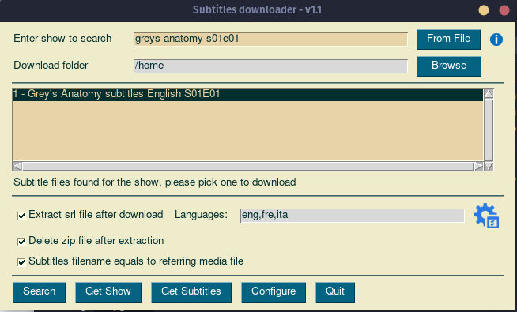

# Download subtitles from www.opensubtitles.org

This program scrapes opensubtitles.org to find and download subtitles.

Local interface GUI with PySimpleGUI.

## Setup

- Clone the project
- Set up a virtual environment in the project root folder `python3 -m venv .venv`
- Activate the virtual environment: `source .venv/bin/activate`
- Install requirements: `pip install -r requirements.txt`
- Change directory to `frontend-gui`
- Copy or rename `config.ini.example` to `config.ini`, edit the `paths` section
- Launch the program: `python gui.py`

You can change the look and feel of the GUI by editing the `looknfeel` key in `config.ini`.
Available themes are:

- SystemDefault
- Reddit
- Topanga
- GreenTan
- Dark
- LightGreen
- Dark2
- Black
- Tan
- TanBlue
- DarkTanBlue
- DarkAmber
- DarkBlue
- Reds
- Green
- BluePurple
- Purple
- BlueMono
- GreenMono
- BrownBlue
- BrightColors
- NeutralBlue
- Kayak
- SandyBeach
- TealMono

## Usage

- Enter search terms by hand or selecting the related media file by clicking "From File", adjust the search terms if anything is found.
- Click "Get Show" to get a list of subtitles files found for that show.
- Select one then click 'Get Subtitles' to download the zipped subtitles file.
- The file will be downloaded in the selected "Download folder", unzipped if "Extract file after download" is checked
